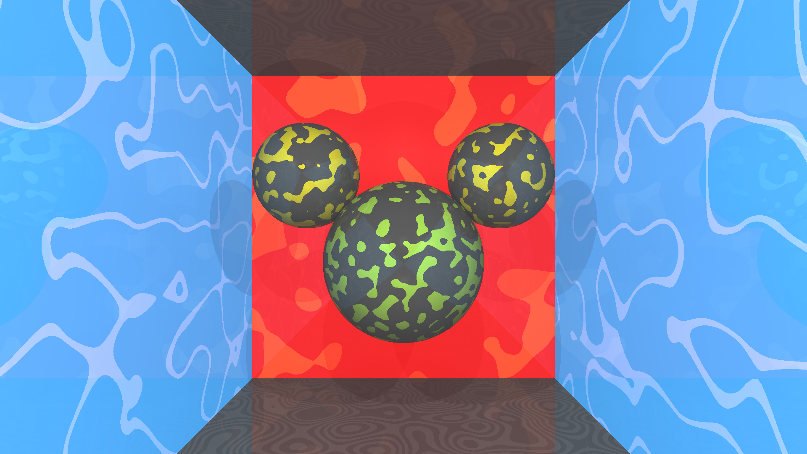

# Computer Graphics project
This project is based on assignment3 ray-tracing, perlin noise is implemented to enhance visual effects on the mickey mouse rock.
# How to use:
> ```
> git clone --recursive https://github.com/MingdiXie/Computer-graphics-project.git
> cd Computer-graphics-project
> mkdir build-release
> cd build-release
> cmake ../ -DCMAKE_BUILD_TYPE=Release
> make
> ```

